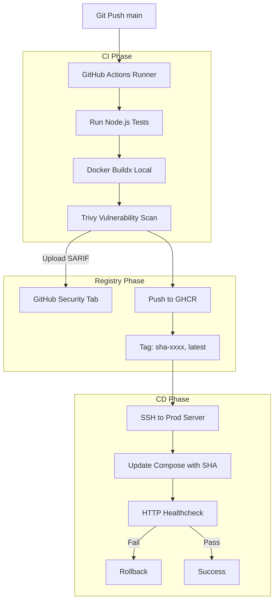

# GitHub Actions Production CI/CD (`devops-github-actions`)

## Overview
This repository defines a secure, end-to-end Continuous Integration and Continuous Deployment (CI/CD) pipeline using GitHub Actions.

## Architecture & Pipeline Flow

## Features Demonstrated

1. **Immutable Releases:** The deployment pulls a specific `sha-xxxx` tag rather than `latest`, preventing race conditions and unexpected updates.
2. **Container Security Scanning:** Integrates Aqua Trivy to block builds with CRITICAL or HIGH CVEs before they ever reach the registry.
3. **Automated Healthchecks:** The deployment script explicitly curl-tests the application's `/health` endpoint before reporting success.
4. **Least-Privilege Token:** The pipeline requests limited `permissions` (e.g., `packages: write`, `contents: read`).
5. **Secure Remote Deployment:** Uses encrypted GitHub Repository Secrets (`PROD_SSH_PRIVATE_KEY`) to SSH into the target host.

## Security Audit
No plaintext credentials exist in this repository. All sensitive data is fetched at runtime from GitHub Secrets.
