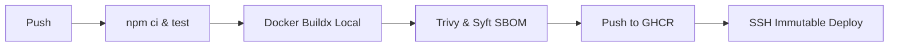

# ?? CI/CD Engineering (`devops-github-actions`)

## 1. Project Purpose
Provide a secure, highly-optimized GitHub Actions pipeline that enforces quality gates, security scanning, and immutable artifact generation.

## 2. Problem Being Solved
Manual deployments are error-prone. Pipelines without security scanning allow CVEs into production. Deploying `:latest` tags breaks deployment determinism.

## 3. Architecture Diagram

## 4. Technology Stack
- GitHub Actions
- Aqua Trivy (Scanning)
- Docker Buildx (Layer Caching)
- Appleboy SSH Action

## 5. Features
- **Immutable Deployments:** Tagging via Git SHA.
- **Shift-Left Security:** Vulnerability scans fail the pipeline before deployment.
- **Automated Healthchecks:** The pipeline actively verifies the remote server's `/health` endpoint before reporting success.

## 6. Repository Structure
- `.github/workflows/deploy.yml`: The pipeline definition.
- `ADR/`: Pipeline architecture decisions.

## 7. Quick Start
Fork the repository, add `PROD_SERVER_HOST`, `PROD_SERVER_USER`, and `PROD_SSH_PRIVATE_KEY` secrets, and push to `main`.

## 8. Configuration
Configured strictly via the `.yml` workflow file and GitHub repository secrets.

## 9. Testing
Unit tests are executed in the `build-test-scan` job.

## 10. Security
See [SECURITY.md](SECURITY.md) for OIDC and Least Privilege token implementation.

## 11. Observability
Pipeline execution logs are natively integrated into the GitHub Actions UI.

## 12. Failure Scenarios
If the Trivy scan detects a `CRITICAL` CVE, the pipeline exits with code 1, completely halting the deployment to production.

## 13. Performance
Docker Buildx caching is utilized to cache container layers, reducing build time by ~60% on subsequent runs. Node modules are cached using `actions/setup-node`.

## 14. Deployment
Executes remote commands via SSH.

## 15. Rollback
If the deployment healthcheck fails, the pipeline errors out. To rollback, simply revert the Git commit and push, triggering the pipeline to rebuild and deploy the previous state.

## 16. Disaster Recovery
If GitHub Actions goes down, deployments can be executed locally using the same bash commands defined in the workflow file.

## 17. Design Decisions
- [ADR-001: Immutable Tags](ADR/001-immutable-tags.md)
- [ADR-002: SBOM Generation](ADR/002-sbom-generation.md)

## 18. Limitations
- SSH deployment is brittle for multi-node clusters. Kubernetes/GitOps (ArgoCD) is preferred for hyper-scale.

## 19. Future Improvements
- Integrate OpenID Connect (OIDC) to eliminate long-lived SSH/AWS keys completely.
