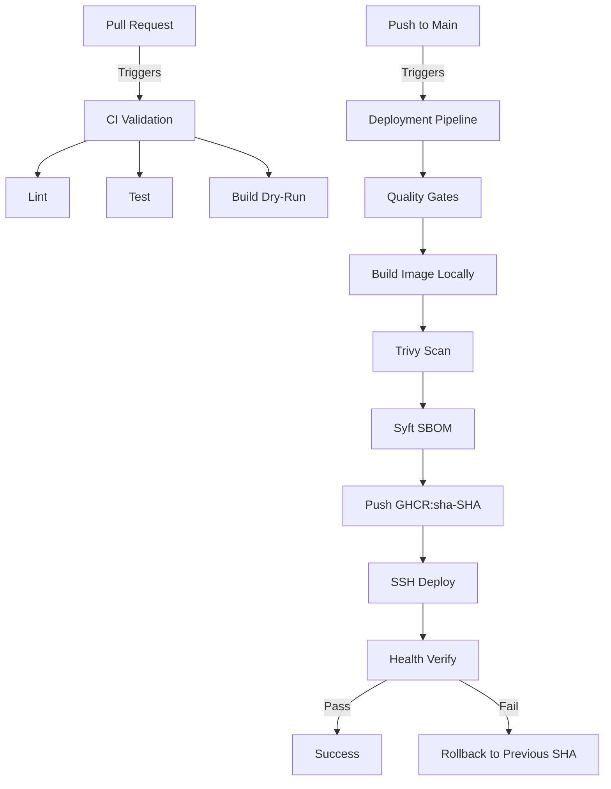

# ?? Production CI/CD Engineering (GitHub Actions)

## 1. Objective
Build a production-oriented GitHub Actions CI/CD demonstration showcasing how a containerized application safely moves from source code to deployment. This repository demonstrates strict artifact integrity: **Build once ? Verify ? Scan ? SBOM ? Publish immutable artifact ? Deploy exact artifact ? Verify ? Rollback if necessary.**

## 2. Pipeline Architecture

## 3. Workflow Details
* **Pull Request (`pr-validation.yml`):** Runs `npm ci`, linting, unit testing, and a dry-run Docker build to prevent broken code from merging. It *never* deploys.
* **Main (`deployment-pipeline.yml`):** Executes the full promotion lifecycle. Fails if Trivy detects CRITICAL/HIGH vulnerabilities.
* **Image Tagging:** Uses immutable `sha-<commit>` tags.
* **Deployment:** Authenticates the remote host to GHCR, pulls the exact SHA, rotates the container, and polls the `/health` endpoint using a bounded HTTP status loop. If the healthcheck fails, it attempts to restart the previous known-good immutable image and verifies the health of the rollback.

## 4. Status & Limitations
**IMPLEMENTED:**
The workflows, security scans, SBOM generation, artifact integrity design, and rollback logic are implemented in YAML and shell scripts.

**RUNTIME VALIDATION BLOCKED:**
*Note: Due to the Docker Engine and a dedicated external SSH target being unavailable in the local environment generating this documentation, end-to-end runtime validations of the deployment workflow are NOT EXECUTED. The pipeline logic is expected but unverified.*

