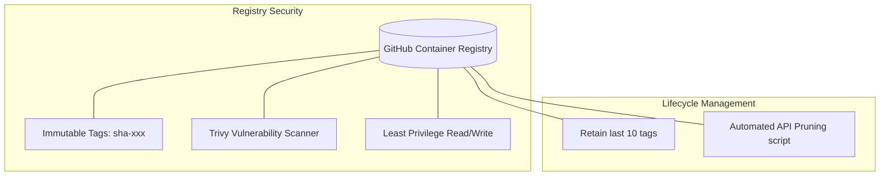

# Container Registry Management (`devops-container-registry`)

## Overview
This repository defines the lifecycle management, retention policies, and security parameters for production container registries (GitHub Container Registry (GHCR), Docker Hub, AWS ECR).

## Architecture

## Features Demonstrated

1. **Immutable Releases:** We never deploy `latest`. Every commit generates a unique `sha-xxxx` tag. `latest` is purely used for local developer convenience.
2. **Container Scanning:** All images pushed to the registry are verified by Aqua Trivy (see `devops-github-actions`).
3. **Registry Cleanup:** Automatically prunes old un-tagged or untagged images via API to reduce storage costs.

## Registry Cleanup Automation
A common issue with GHCR and ECR is out-of-control storage bills due to thousands of stale container images.

See `registry-cleanup.sh` for an API-driven script that targets GHCR to retain only the most recent 15 images.
