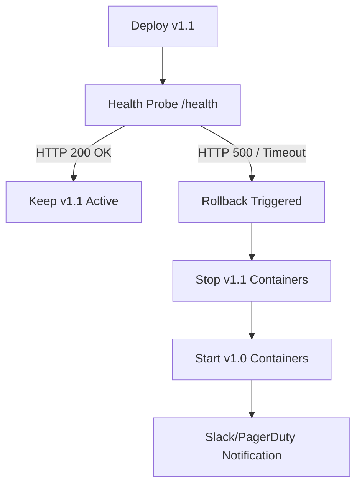

# ?? Automated Deployment Rollback (`devops-deployment-rollback`)

## 1. Project Purpose
Provide the automation and architectural patterns required to instantly revert a failed deployment to a known-stable state.

## 2. Problem Being Solved
Deployments occasionally pass CI but fail in production (e.g., due to missing environment variables). Manual rollback takes minutes, causing extensive downtime.

## 3. Architecture Diagram

## 4. Technology Stack
- Bash (Automation Scripts)
- Docker Compose
- GitHub Actions

## 5. Features
- **Instant Reversion:** Leverages immutable `sha` tags.
- **Automated Trigger:** Tied directly to HTTP health probes.

## 6. Repository Structure
- `rollback.sh`: The executable rollback engine.
- `ADR/`: Database migration strategies.

## 7. Quick Start
`./rollback.sh <PREVIOUS_SHA>`

## 8. Configuration
Requires the `COMPOSE_FILE` and previous SHA context.

## 9. Testing
A mock failing container can be deployed to trigger the script.

## 10. Security
The rollback script must run with sufficient privileges to execute docker commands.

## 11. Observability
Rollback events log to `stdout` and trigger an alert webhook.

## 12. Failure Scenarios
If the rollback script itself fails, manual intervention via SSH is required.

## 13. Performance
Container start times (as benchmarked in `devops-docker`) dictate the RTO (Recovery Time Objective) of the rollback (typically < 3 seconds).

## 14. Deployment
Integrated directly into the CI/CD pipeline.

## 15. Rollback
This repository *is* the rollback mechanism.

## 16. Disaster Recovery
If the server is lost, deploy to a new instance using the last known stable SHA.

## 17. Design Decisions
- [ADR-001: Expand and Contract Migrations](ADR/001-database-migrations.md)

## 18. Limitations
- Does not automatically rollback database schemas.

## 19. Future Improvements
- Integrate with ArgoCD for automated Kubernetes rollback based on Prometheus metrics.
