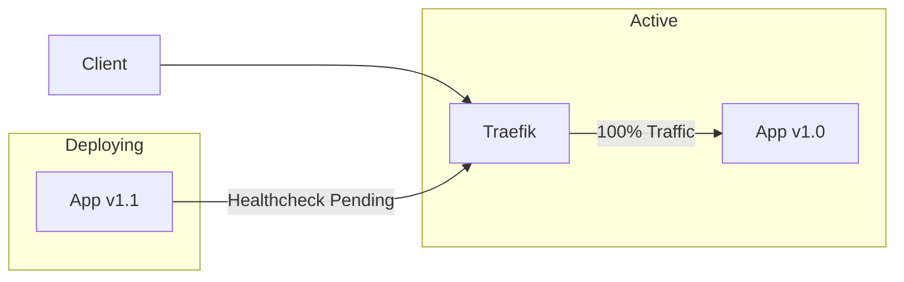

# ?? Zero-Downtime Deployments (`devops-zero-downtime-deployment`)

## 1. Project Purpose
Eliminate 502 Bad Gateway errors and dropped connections during application updates.

## 2. Problem Being Solved
Standard deployments kill the active container before the new one is ready to accept connections.

## 3. Architecture Diagram

## 4. Technology Stack
- Docker Compose V2
- Traefik
- Node.js (Graceful Shutdown)

## 5. Features
- **Connection Draining:** Old containers finish processing existing requests before exiting.
- **Traffic Shifting:** Traefik dynamically routes traffic only when the new container is healthy.

## 6. Repository Structure
- `ADR/`: Blue/Green vs Rolling analysis.

## 7. Quick Start
Review the Docker Compose `--no-deps` execution strategy.

## 8. Configuration
Requires proper `HEALTHCHECK` definitions in the Dockerfile.

## 9. Testing
Use an external load testing tool (e.g., `hey` or `k6`) to send continuous traffic during a deployment. Result should be 0 dropped connections.

## 10. Security
Standard container security applies.

## 11. Observability
Monitor Traefik access logs during the cutover window.

## 12. Failure Scenarios
If the Green deployment fails its healthcheck, traffic remains on Blue indefinitely.

## 13. Performance
Temporary 2x memory/CPU footprint during deployment.

## 14. Deployment
Executed via CI/CD.

## 15. Rollback
Switch traffic back to Blue.

## 16. Disaster Recovery
Standard orchestrator recovery.

## 17. Design Decisions
- [ADR-001: Blue/Green vs Rolling](ADR/001-blue-green-vs-rolling.md)

## 18. Limitations
- Native Docker Compose Blue/Green is manual compared to Kubernetes `Deployments`.

## 19. Future Improvements
- Move to Kubernetes.
